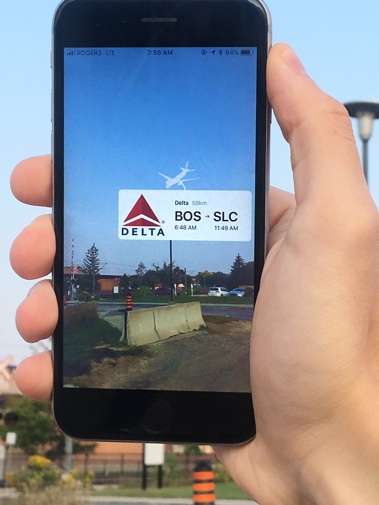

## AR Planes

AR Planes is an app that lets you visualize and discover the planes flying around you. It uses ARKit to show all of the planes nearby in augmented reality. You can tap on a plane to find out additional information, like the airline, origin airport, and final destination.

This project was a **finalist** (Top 14 out of 218 projects) at Hack the North 2017 in Waterloo, ON, Canada.

**[Watch a video demo](https://www.youtube.com/watch?v=dnYHQ-7wlag)**
 

